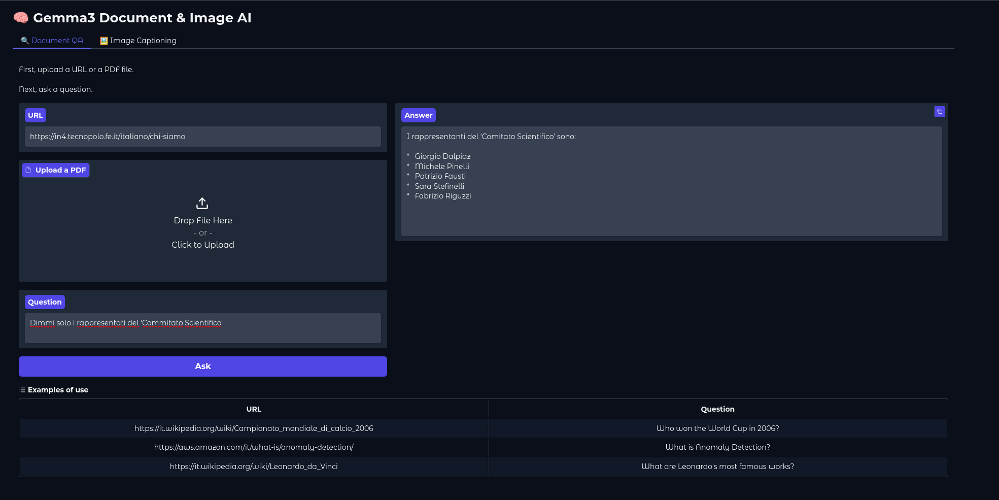
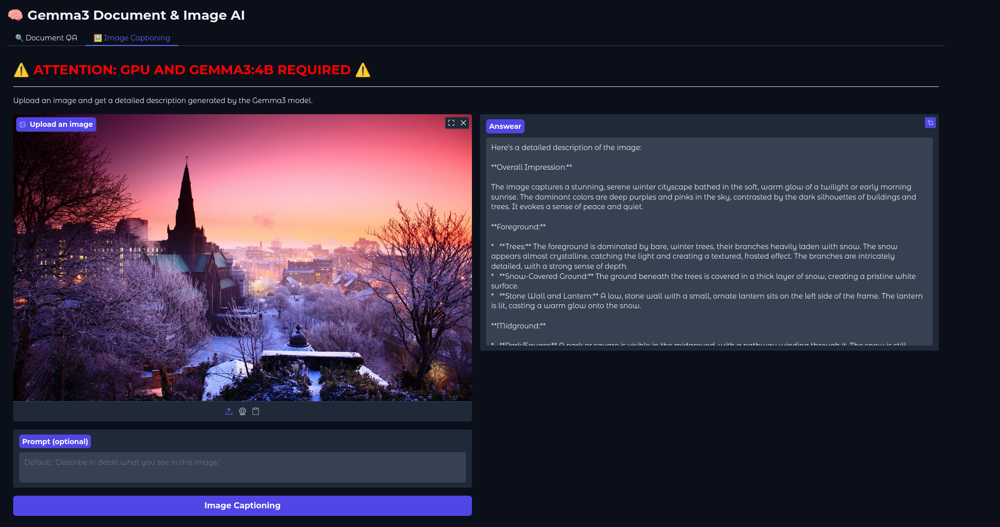

# RAG Web+PDF QA

A Question Answering (QA) system in Italian based on Retrieval-Augmented Generation (RAG). It can answer user queries by leveraging content from PDF documents, web URLs, and even images.

## Features

- 📄 Advanced PDF extraction (uses 3 loaders: `PyPDFium2`, `PDFMiner`, `PyPDF`)
- 🌐 Content loading from URLs (`WebBaseLoader`)
- ✂️ Automatic text splitting using `RecursiveCharacterTextSplitter`
- 🧠 Semantic embeddings via `OllamaEmbeddings` (`nomic-embed-text` model)
- 🛢️ Indexing and retrieval with `Chroma` vector store
- 💬 Answer generation with a local LLM (`gemma3`)
- 🗂️ Metadata enhancement by extracting section titles from documents
- 🌐 User interface built with [Gradio](https://gradio.app/)
- 🖼️ Image captioning support for extracting textual descriptions from images

## How It Works

- **Input**: The user provides a URL, PDF file, and/or image
- **Extraction**: The content is cleaned, split, and converted into embeddings  
- **Indexing**: The text chunks are stored in a Chroma vectorstore  
- **Retrieval**: The system selects the most relevant documents or image captions for the question  
- **LLM**: A contextual answer is generated using the `gemma3` model

## Notes

- Only supports `.pdf` files smaller than 50MB  
- Answers are based solely on the provided content (Web + PDF + Images) 
- The system clearly states when no relevant information is found in the context

## Project 
The project has the following structure:
```plaintext
.
├── rag_llm.py                # Code
├── requirements.txt          # Requirements 
└── README.md             

```

## Repository
Clone the repo: `git clone git@github.com:Nicolas01011998/RAG_url_pdf.git`

## Environment
### Conda environment
To run the script, you first need to set up a Conda environment with Python 3.12 and install the required libraries.
If you already use Python 3.12 you can also use `venv`
1. Download the Miniconda installer:
   ```bash
   curl -O https://repo.anaconda.com/miniconda/Miniconda3-latest-Linux-x86_64.sh 
    ```
    If you have an ARM processor (e.g., Raspberry Pi 4), replace x86_64 with aarch64.

2. Run the installer:
   ```bash
   bash Miniconda3-latest-Linux-x86_64.sh
    ```
    + Press Enter to scroll through the license, then type yes to accept.
    + Choose the installation directory (default: ~/miniconda3).
    + When prompted, type yes to run conda init and enable shell integration.

4. Activate the changes and check conda version:
   ```bash
   source ~/.bashrc
    ```

5. Verify the Conda's installation:
   ```bash
   conda --version
    ```
    The output should be something like: conda 24.11.0


6. Create a Conda environment named `conda_python_3_12` with Python 3.12:
   ```bash
   conda create --name conda_python_3_12 python=3.12
    ```

7. Activate the environment:
    ```bash
    conda activate conda_python_3_12
    ```


8. Verify the `conda_python_3_12` installation:
    ```bash
   conda env list
    ```

9. Install the required libraries using pip.
    ```bash
    pip install -r requirements.txt
    ```

### 3. Ollama 
Download and install Ollama on Linux
```
curl -fsSL https://ollama.com/install.sh | sh
```
Disable Ollama Service:
```
sudo systemctl disable --now ollama.service
```

Start Ollama in the background
```
ollama serve &
```

Pull models:
```
ollama pull nomic-embed-text
ollama pull gemma3:0.6b
```

Models' list:
```
ollama list
```

## Run script
```
python rag_llm.py
```

## Example of Visualization 




## End of the lab
Stop Ollama (to delete the models use `ollama rm model-name`)

```bash
pkill -f "ollama serve"
```
